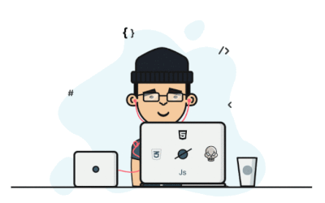

<h1 align="center">
  
  𝐇𝐞𝐥𝐥𝐨, &lt;𝚌𝚘𝚍𝚎𝚛𝚜/&gt;!
  
</h1>

 
 

- 🔭 𝙸’𝚖 𝚌𝚞𝚛𝚛𝚎𝚗𝚝𝚕𝚢 𝚠𝚘𝚛𝚔𝚒𝚗𝚐 𝚘𝚗 **𝙳𝚊𝚝𝚊 𝚂𝚌𝚒𝚎𝚗𝚌𝚎 𝚊𝚗𝚍 𝚆𝚎𝚋 𝙳𝚎𝚟𝚎𝚕𝚘𝚙𝚖𝚎𝚗𝚝**
- 🌱 𝙸’𝚖 𝚌𝚞𝚛𝚛𝚎𝚗𝚝𝚕𝚢 𝚕𝚎𝚊𝚛𝚗𝚒𝚗𝚐 **𝙳𝚎𝚟𝙾𝚙𝚜 𝚊𝚗𝚍 𝙲𝚘𝚖𝚙𝚎𝚝𝚒𝚝𝚒𝚟𝚎 𝙿𝚛𝚘𝚐𝚛𝚊𝚖𝚖𝚒𝚗𝚐**
- 👯 𝙸’𝚖 𝚕𝚘𝚘𝚔𝚒𝚗𝚐 𝚝𝚘 𝚌𝚘𝚕𝚕𝚊𝚋𝚘𝚛𝚊𝚝𝚎 𝚘𝚗 **𝙰𝚗𝚍𝚛𝚘𝚒𝚍, 𝙳𝚊𝚝𝚊 𝚂𝚌𝚒𝚎𝚗𝚌𝚎 𝚘𝚛 𝚆𝚎𝚋 𝙳𝚎𝚟𝚎𝚕𝚘𝚙𝚖𝚎𝚗𝚝**
- 💬 𝙰𝚜𝚔 𝙼𝚎 𝙰𝚋𝚘𝚞𝚝 𝙰𝚗𝚢𝚝𝚑𝚒𝚗𝚐 [here](https://github.com/Lovakush/Lovakush/issues/1) ! 𝙸 𝚊𝚖 𝚑𝚊𝚙𝚙𝚢 𝚝𝚘 𝚑𝚎𝚕𝚙.
- 😄 𝙿𝚛𝚘𝚗𝚘𝚞𝚗𝚜 : **𝙷𝚎/𝙷𝚒𝚖/𝙷𝚒𝚜**
- ⚡ 𝙵𝚞𝚗 𝚏𝚊𝚌𝚝 : **𝙱𝚎𝚜𝚝 𝙿𝚊𝚛𝚝 𝙾𝚏 𝚃𝚑𝚎 𝙹𝚘𝚞𝚛𝚗𝚎𝚢 𝙸𝚜 : *𝙸𝚝 𝙴𝚗𝚍𝚜***

 
 

   •  
   •   
  

#

  
  
  

#

 

**𝙻𝙰𝙽𝙶𝚄𝙰𝙶𝙴𝚂 𝙰𝙽𝙳 𝚃𝙾𝙾𝙻𝚂:**  
 
 
<code></code>
<code></code>
<code></code>
<code></code>
<code></code>
<code></code>
<code></code>
<code></code>
<code></code>
#
<code></code>
<code></code>
<code></code>
<code></code>
<code></code>
<code></code>
<code></code>
<code></code>
<code></code>

 

#

  <g-emoji class="g-emoji" alias="chart_with_upwards_trend" fallback-src="https://github.githubassets.com/images/icons/emoji/unicode/1f4c8.png">📈</g-emoji>
  <strong>𝙶𝚒𝚝𝚑𝚞𝚋 𝚂𝚝𝚊𝚝𝚜 : </strong>

 

    
    

 

 

#

 
 

#

    
  <h4 align="center"><code>📊 𝙶𝚒𝚝𝙷𝚞𝚋 𝙼𝚎𝚝𝚛𝚒𝚌𝚜</code></h4>

<h1>
  Connect With Me
  
</h1>

   
  <a href="https://www.linkedin.com/in/lova-kush-4a568b1b6/" target="_blank">
    <code></code>
  </a>
  <a href="https://www.facebook.com/lovekush.pamar" target="_blank">
    <code></code>
  </a>
  <a href="https://www.instagram.com/lovakush_thakur/" target="_blank">
    <code></code>
  </a>
  <a href="https://twitter.com/Lovekus16018977" target="_blank">
    <code></code>
  </a>     

 

  <a href="https://www.hackerrank.com/thakurlovakush" target="_blank">
    <code></code>
  </a>

  <a href="https://codeforces.com/profile/Lovakush_1" target="_blank">
    <code></code>
  </a>

  <a href="https://www.codechef.com/users/lovakush_1" target="_blank">
    <code></code>
  </a>
  
  <a href="https://leetcode.com/Lovakush/" target="_blank">
    <code></code>
  </a>

 
 

### 𝚂𝚑𝚘𝚠 𝚜𝚘𝚖𝚎 ❤️ 𝚋𝚢 𝚜𝚝𝚊𝚛𝚛𝚒𝚗𝚐 𝚜𝚘𝚖𝚎 𝚘𝚏 𝚝𝚑𝚎 𝚛𝚎𝚙𝚘𝚜𝚒𝚝𝚘𝚛𝚒𝚎𝚜!

#

  
